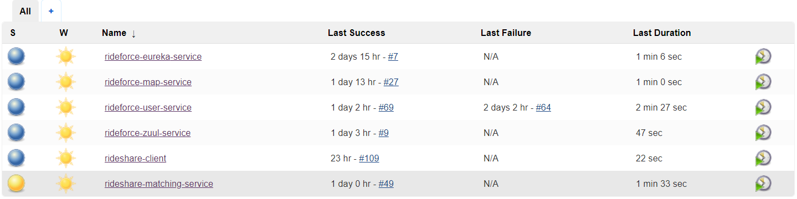
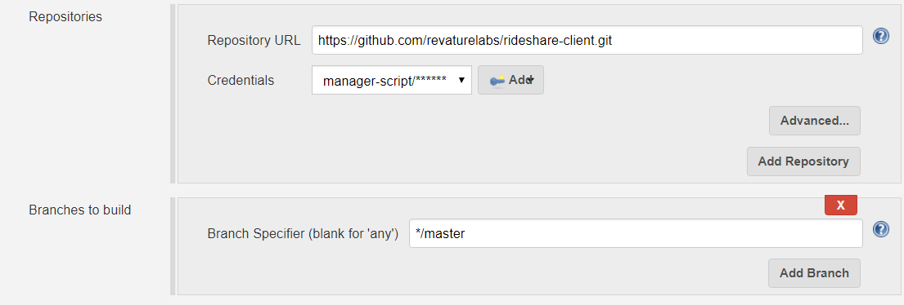
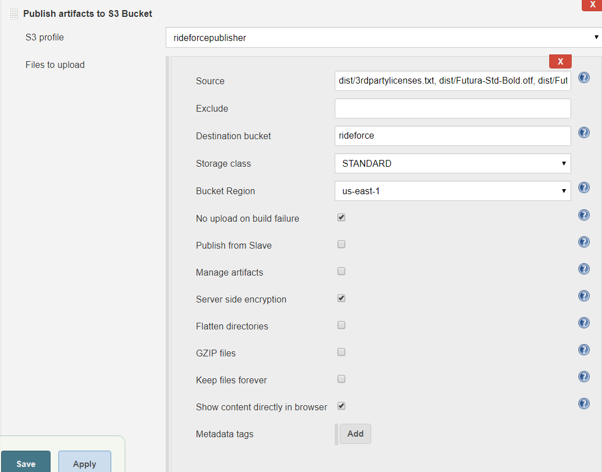
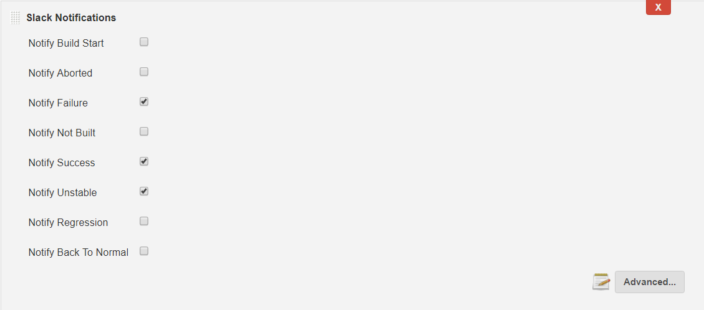
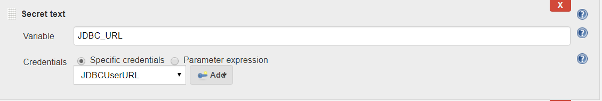
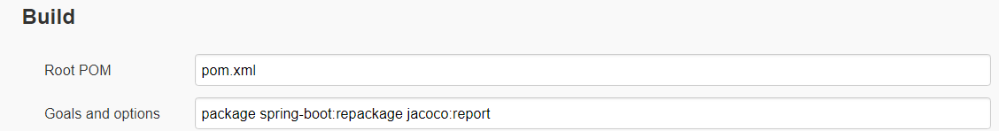

# Project 3 - Revature Rideforce: Ridesharing Application
Rideforce is a ride sharing application that allows users to find rides to work using the Google Maps API.

I was one of three team leads for this project, and in my role, I managed the **DevOps** team.

My duties for the Rideforce project included:
- Managing a DevOps team and delegating tasks to these team members.
- Implementing, creating, and managing a collection of Docker containers which allowed us to separate and isolate all of our various microservices.
- Implementing a Jenkins pipeline for the continuous deployment of our microservices.
- Managing RDS, EC2, and S3 instances using Amazon Web Services.
- Creating a separate development environment in order to isolate development from production. This environment also included a continuous deployment pipeline.
- Automating testing with the use of quality gates in order to ensure that code with failing tests or other similar issues would not be deployed to production.
- Automating code quality and test coverage management through the use of SonarCloud/SonarQube and Jacoco, respectively.
- Generating documentation using Javadocs and Compodoc, and automated the hosting of this documentation via Amazon S3.

Technologies I've used for this project included: **Jenkins**, **Amazon Web Services**, **EC2**, **S3**, **RDS**, **Trello**, **Git**, **Github**, **Jacoco**, **Docker**, **Docker**, **SonarCloud/SonarQube**.

---

## Project 3 DevOps Pipeline Workflow

After EC2, S3, RDS, and any other Amazon Web Services instances are created and basic dependencies are added to our EC2 (such as the JDK, Jenkins, etc.), the continuous integration and deployment pipeline is as follows:

### Front-end Pipeline

Two development environments were created for the front-end application: dev and master.

First, the pipeline items were created within Jenkins. These items were "freestyle projects", as they did not require a build tool such as Maven. In this case, the front-end Jenkins build was named '**rideshare-client**'.

Appropriate plug ins such as Node, S3 Publisher, Github, and Slack integrations were all added.

The primary trigger for the Jenkins build is via Github polling, i.e., whenever code is merged into a dev or master branch, respectively, Jenkins starts the build process.

Jenkins executes a custom script to begin the Angular app build using `ng build` along with any tests using Karma via a headless browser (PhantomJS). Then, if everything was successful, the content of the build is published to an AWS S3 bucket with a custom post build script to configure static site hosting for the bucket.

Finally, Jenkins will automatically publish build results to a community Slack channel so that members from all of the development teams (microservices team, front-end team, and DevOps team) can easily begin the process of communication and troubleshooting broken and failed builds.

### Java/Backend Pipeline with Microservices

Two environments were created for the Java/backend portion of the application, where each microservice has its own unique and isolated Jenkins pipeline.

First, the pipeline items were created within Jenkins. These items were "Maven projects", as they required a build tool such as Maven to be packaged and built. All of these Jenkins jobs are named according to their respective microservice.

Appropriate plug ins such as Maven, Github, Jacoco, and Slack integrations were all added.

The primary trigger for the Jenkins build is via Github polling, i.e., whenever code is merged into a dev or master branch, respectively, Jenkins starts the build process.

Seeing as the project was using environment variables for certain credentials such as the RDS URL without a configuration server, these environment variables were added as secret text to each job.

Since this is a Java project using Maven, a goal is added to the build as seen below where we also signify that we want Jacoco to run a test report:

Using a custom Jenkins post-build script, upon build success Jenkins executes the following commands:

- Kills any process of the already running instances of the microservice
- Ensures no leaked processes via Jenkins BUILD_ID
- Adds env variables outlined in the "Secret Text" in a previous step, such as an API key
- Automatically executes that JAR as a background process using the `nohup` utility in Linux
- Executes SonarCloud code analysis which is then automatically deployed to SonarCloud's browser analytics site

Finally, Jacoco runs test coverage analytics for display in Jenkins and any desired Slack notifications are sent to various development teams.

If all steps are successful and tests pass, then the application is deployed to its appropriate environment in the appropriate EC2.